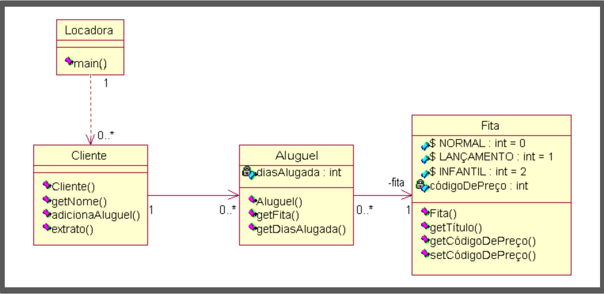

# Perguntas

1) O que acontece se extrato de um cliente deve agora retornar no formato HTML, ao invés de String?

2) O que ocorre se as regras de cálculo e preço mudarem?

3) Se classificação das fitas mudar toda semana?

4) Se esquema de pontos de alugador puder mudar a qualquer hora?

---

# Respostas

1) O que acontece se extrato de um cliente deve agora retornar no formato HTML, ao invés de String?

    **Problema:** Será necessário alterar o método extrato() de Client, ou criar um novo método para retornar HTML. Ou seja, será necessário mudar a classe Client, o que não segue o padrão SOLID.

    **Solução:** Implementar o padrão Strategy com interface `ExtratoStrategy` e classes `ExtratoTextoStrategy`, `ExtratoHtmlStrategy`. Cliente usa `ExtratoFactory.criarExtrato("html")`. 
        

2) O que ocorre se as regras de cálculo e preço mudarem?

    **Problema:** As regras de cálculo estão hardcoded dentro das estratégias de extrato. Se mudar o preço do NORMAL de R$ 2 para R$ 3, ou se mudar a lógica de dias extras, será necessário alterar múltiplas classes.

    **Solução:** Extrair as regras de cálculo para uma interface `CalculadoraPrecoStrategy` com implementações específicas:
    - `CalculadoraPrecoNormalStrategy` (R$ 2 + R$ 1,50 por dia extra após 2 dias)
    - `CalculadoraPrecoLancamentoStrategy` (R$ 3 por dia)
    - `CalculadoraPrecoInfantilStrategy` (R$ 1,50 + R$ 1,50 por dia extra após 3 dias)
    
    Assim, mudanças de preço afetam apenas a calculadora específica, não as estratégias de extrato.
    

3) Se classificação das fitas mudar toda semana?

    **Problema:** As classificações estão hardcoded como constantes estáticas em `Tape.java` (NORMAL=0, LANCAMENTO=1, INFANTIL=2). Se mudar a classificação ou adicionar novos tipos, será necessário alterar múltiplas classes que usam esses códigos.

    **Solução:** Criar um sistema de classificação flexível usando enum ou classes com Factory:
    - Interface `ClassificacaoFitaStrategy` com métodos `getCodigo()`, `getNome()`, `getCalculadoraPreco()`
    - Implementações: `ClassificacaoNormalStrategy`, `ClassificacaoLancamentoStrategy`, `ClassificacaoInfantilStrategy`
    - `ClassificacaoFitaFactory` para criar classificações
    - `Tape` recebe `ClassificacaoFitaStrategy` ao invés de `int codigoDePreco`
    
    Assim, novas classificações são adicionadas sem modificar código existente, seguindo o padrão Strategy.

4) Se esquema de pontos de alugador puder mudar a qualquer hora?

